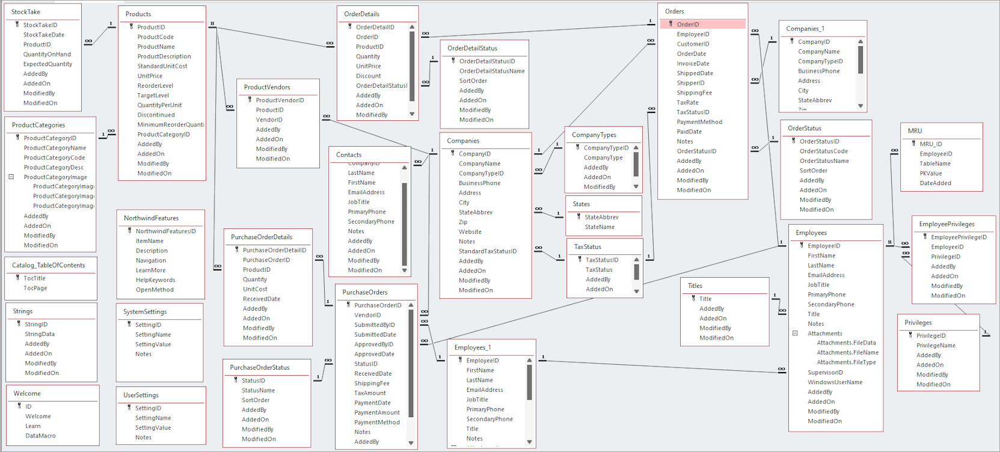
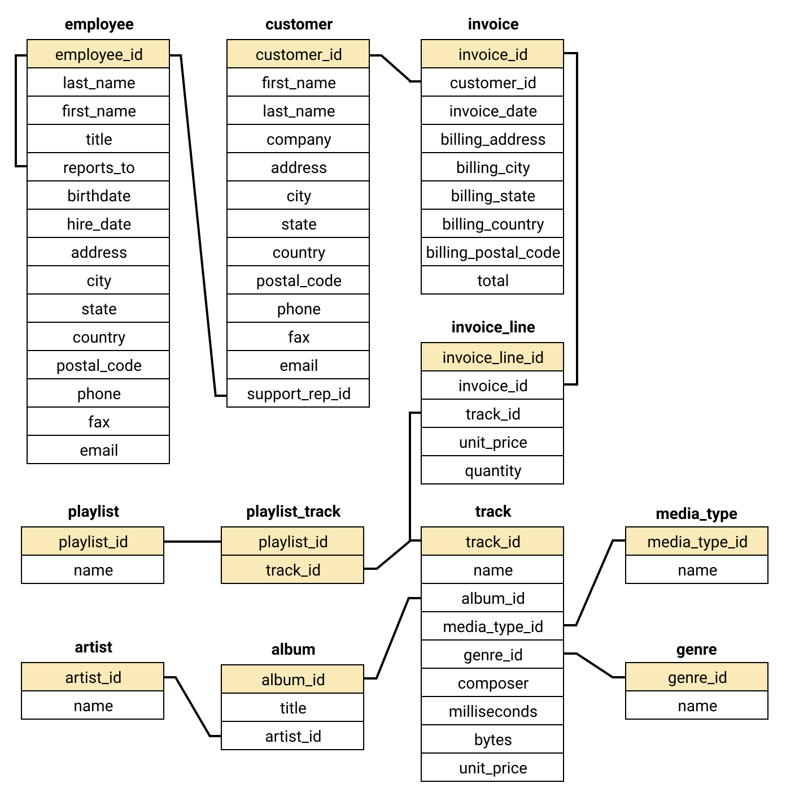

# 📚 Curso Completo de SQL

> Este repositorio está diseñado para proporcionar una guía práctica y completa para aprender SQL, desde los conceptos básicos hasta las consultas más avanzadas. Cada consulta SQL está acompañada de su explicación detallada y ejemplos prácticos utilizando bases de datos populares como **AdventureWorks**, **Chinook** y **Northwind**.

---

## 📌 Contenido

El contenido está organizado en dos grandes secciones:

1. **Data Definition Language (DDL)**  
   Aprende a definir y estructurar bases de datos, tablas y relaciones.

2. **Data Manipulation Language (DML)**  
   Aprende a consultar, insertar, actualizar y eliminar datos de las tablas.

Cada tema incluye:
- Archivos `.sql` con las consultas correspondientes.
- Archivos `.md` con explicaciones detalladas y ejemplos prácticos.

---

## 📂 Estructura del Proyecto

La estructura del proyecto está organizada en carpetas según el tipo de operación SQL:

### **1. Data Definition Language (DDL)**

- **`create-db/`**: Crear bases de datos.
- **`create-table/`**: Crear tablas con campos personalizados.
- **`alter-table/`**: Modificar tablas existentes.
- **`constraints/`**: Uso de restricciones como claves primarias, foráneas, únicas, etc.
- **`drop-db/`**: Eliminar bases de datos.
- **`drop-table/`**: Eliminar tablas.
- **`truncate-table/`**: Vaciar tablas sin eliminar su estructura.

### **2. Data Manipulation Language (DML)**

- **`select/`**: Consultas básicas y avanzadas.
- **`insert-into/`**: Insertar datos en tablas.
- **`update/`**: Actualizar datos existentes.
- **`delete/`**: Eliminar datos de tablas.
- **`joins/`**: Combinar datos de múltiples tablas (INNER JOIN, LEFT JOIN, etc.).
- **`group-by/`**: Agrupar datos y realizar cálculos agregados.
- **`having/`**: Filtrar resultados agrupados.
- **`order-by/`**: Ordenar resultados.
- **`functions/`**: Uso de funciones como `SUM`, `AVG`, `COUNT`, etc.
- **`operators/`**: Operadores lógicos, de comparación y aritméticos.

---

## 🧩 Ejemplo Práctico

### **Base de Datos: Northwind**

#### **Consulta: Productos más vendidos por categoría**

Archivo: `group-by/GroupBy.sql`

```sql
-- filepath: [groupBy.sql](http://_vscodecontentref_/0)
SELECT 
    Categories.CategoryName AS Categoria,
    Products.ProductName AS Producto,
    SUM(OrderDetails.Quantity) AS CantidadVendida
FROM 
    Products
INNER JOIN 
    Categories ON Products.CategoryID = Categories.CategoryID
INNER JOIN 
    OrderDetails ON Products.ProductID = OrderDetails.ProductID
GROUP BY 
    Categories.CategoryName, Products.ProductName
ORDER BY 
    CantidadVendida DESC;
```

---

## 🧪 Cómo Usar Este Repositorio

1. **Clona el repositorio**:
    ```bash
    git clone https://github.com/tuusuario/sql-course.git
    cd sql-course
    ```

2. **Configura una base de datos**:  
   Descarga e importa una base de datos de ejemplo como **Northwind**, **AdventureWorks** o **Chinook**.

3. **Ejecuta las consultas**:  
   Usa un cliente SQL como **MySQL Workbench**, **SQL Server Management Studio** o **DBeaver** para ejecutar las consultas.

4. **Explora las explicaciones**:  
   Cada consulta tiene un archivo `.md` con explicaciones detalladas.

---

## 🖼️ Ejemplo Visual

### **Diagrama de Relaciones: Northwind**

<div align="center">
  
</div>  

*Figura 1. Diagrama de relaciones de la base de datos Northwind.*

---

### **Diagrama de Relaciones: Chinook**

<div align="center">
  
</div>  

*Figura 1. Diagrama de relaciones de la base de datos Chinook.*

---

## 🚀 Estado Actual

✅ Contenido completo  
🧪 Probado con bases de datos de ejemplo  
📂 Estructura organizada por temas  

---

## 📄 Licencia

Este proyecto es de uso educativo y está disponible bajo la licencia MIT. Si deseas contribuir o reutilizar el contenido, por favor, menciona la fuente.

---

## 🙋‍♂️ Autor

Desarrollado por **Jorge Infante Fragoso**

Estudiante de Ingeniería en Computación

Universidad Autónoma Metropolitana – Unidad Cuajimalpa

### 📬 Contacto

Para dudas, sugerencias o colaboración, escribe a:  
jinfante2212@gmail.com


